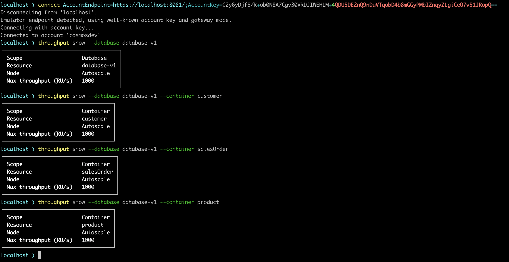
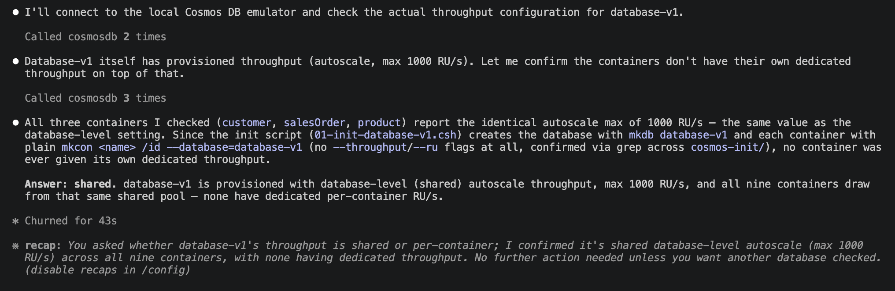

# Cosmos DB Shell unlocks agentic workflows with an MCP toolkit

**Azure Cosmos DB** Shell is an open-source command-line interface with integrated Model Context Protocol (MCP) server support.

Earlier this year I was one of the winners of the [Azure Cosmos DB Conf Skills Challenge](https://learn.microsoft.com/en-us/credentials/certifications/azure-cosmos-db-conf-skills-challenge), and the prize was a voucher to sit the [DP-420 exam](https://learn.microsoft.com/en-us/credentials/certifications/azure-cosmos-db-developer-specialty) — with a deadline of June 30th to actually use it. I passed somehow. But I already use Cosmos DB at work day to day, and these days AI adoption is pushing so much new functionality out the door that the technology never really stands still.

My actual first experience with Cosmos DB, two years ago, was, let's say not good. The emulator flat out didn't run on ARM64 — not even inside Windows on an ARM Mac — so for roughly half the year, running it locally was simply impossible, so I filed [an issue](https://github.com/Azure/azure-cosmos-db-emulator-docker/issues/99#event-14127106452). The other half of the year the Docker image worked, but with real limitations compared to the Windows version, and I ended up rebuilding my entire CI pipeline around those constraints. Every preview build of the vNext emulator I tried along the way had something broken or missing — but the GA release actually delivered, which is exactly why I'm this excited about it now.

**DP-420** is a developer specialty exam, so the project has labs that are all about building and querying Cosmos DB databases.
I'll be glad if it helps you prepare for the exam too — this article uses that same repo, so don't be surprised if you spot some exam-related content along the way:

```bash
git clone https://github.com/wondertalik/cosmos-dp-420.git
```

The first thing I tried once I had it cloned was wiring up **CosmosDBShell's MCP server** so Claude Code could drive the local emulator directly. It didn't work. `.mcp.json` pointed at the shell's Streamable HTTP endpoint, the shell was running in its own terminal, Claude Code was connected — and every tool call either hung on the handshake or died after the first one.

**CosmosDBShell's MCP** support is still preview, so hitting rough edges wasn't exactly a shock. What was different this time: it's open source, so instead of just filing an issue and waiting, I had the option to actually go read `ShellInterpreter` and see what was happening. So I did.

## What I found

Two separate bugs, both present in the published NuGet builds through at least `1.1.115-preview`:

1. **An invalid MCP protocol version.** The published build advertises a protocol version Claude Code rejects outright. The handshake never completes, so no tool call ever gets a chance to run.
2. **A `CancellationTokenSource` disposal bug in `ShellInterpreter`.** Even past the first bug, the shell disposes its cancellation token source while it's still in use. The first MCP tool call in a session might succeed. Every call after that fails against a disposed token.

I fixed both and opened [Azure/CosmosDBShell#150](https://github.com/Azure/CosmosDBShell/pull/150). As of this writing, that PR is **still open, unmerged** — this is preview software from a small team, and PRs take the time they take. If you're reading this later, it's worth checking the PR status yourself before assuming it's landed.

## The workaround: a patched local build

Until #150 merges and ships in a published release, install the locally-patched fork instead of a plain `dotnet tool install`/`update`:

```bash
dotnet tool install --global --add-source "cosmosdbshell" CosmosDBShell --version "1.1.123-preview.g8da79a2066"
```

Confirm it took:

```bash
cosmosdbshell --version
# -> CosmosDBShell 1.1.123-preview (8da79a2066)  [or later, once the upstream PRs ship]
```

Then run the **CosmosDBShell with MCP** server itself in its own terminal — it has to already be listening before your agent tries to connect:

```bash
cosmosdbshell --mcp --connect "AccountEndpoint=https://localhost:8081/;AccountKey=C2y6yDjf5/R+ob0N8A7Cgv30VRDJIWEHLM+4QDU5DE2nQ9nDuVTqobD4b8mGGyPMbIZnqyMsEcaGQy67XIw/Jw==" --connect-mode gateway
```

That connection string is the well-known Cosmos DB emulator key — not a secret, just the same default every local emulator ships with. Your `.mcp.json` should point at the shell's Streamable HTTP endpoint (`type: "http"`, `url: "http://127.0.0.1:6128/"`), and the client — Claude Code or Copilot — dials that URL rather than spawning the shell process itself.

Before bringing the stack up, two things need to exist first: a `.env.dev` file (it's gitignored, so you create it yourself) and a self-signed certificate. Both are covered step by step in the repo's `README.md` — follow that before continuing here.

## Standing up the emulator and asking a real question

With the shell running, bring up the rest of the stack:

```bash
docker compose -f docker-compose.yaml --env-file .env.dev -p cosmos-dp420 up --build --remove-orphans
```

This repo ships four schema variants of the same Adventure Works-style sample data — `database-v1` through `database-v4` — each demonstrating a different modeling trade-off. For this walkthrough I'll use `database-v1` as the example, which is already seeded in my local emulator.

By default, the emulator's own [bootstrap mechanism](https://devblogs.microsoft.com/cosmosdb/announcing-general-availability-of-the-azure-cosmos-db-vnext-emulator/) — it runs any `.csh` scripts it finds at the top level of `cosmos-init/`, in alphabetical order, before it starts accepting requests — creates **all four** databases and their containers, empty. That happens automatically, no copying required. To actually get documents into one of them, copy that version's subfolder into `cosmos-init/`'s top level before you bring the stack up — for `database-v1`, that's the contents of `cosmos-init/database-v1/`. This only matters on the very first start: once the data volume already has content, the bootstrap step is skipped on later restarts. If you ever want to reseed from scratch, stop the container, delete the Cosmos data volume, and bring the stack back up.

There's also a `load-data.py` Python loader in this repo, as a second way to get the same data in. Which one you use is up to you — the repo's README documents both. In practice, I've found the `.csh` copy-in approach works fine for `database-v1`, but it errored out for me on `database-v3`, so I used the Python loader there instead.

Those `.csh` scripts aren't hand-written sample data — they're a straight transformation of the original JSON files I pulled from Microsoft's own [mslearn-cosmosdb-modules-central](https://github.com/MicrosoftDocs/mslearn-cosmosdb-modules-central) repo (vendored here as `mslearn-cosmosdb-modules-central-main/`), reshaped into `cosmosdbshell`'s `mkcon`/`mkitem` command format so the emulator's bootstrap mechanism could load it directly. That data is the same dataset used in the actual DP-420 training modules — so everything you query in this walkthrough is exam-relevant, not a toy dataset invented for the article.

Now for the actual payoff of having an agent talk to your database instead of you writing a script: I asked **Claude**, through the MCP `cosmosdb` connection, a question I genuinely didn't know the answer to — **is database-v1's throughput shared across its nine containers, or does each container have its own dedicated RU/s?**

That's not a question you can answer by staring at `cosmos-init/`'s `mkcon` calls alone, because none of them pass a `--ru` or `--scale` flag — the interesting behavior is in what the emulator actually *does* by default, not what the scripts say. The agent connected, then ran `throughput show` at the database scope, then again against three separate containers — `customer`, `salesOrder`, and `product`:



The response was



All four calls — the database and all three containers — returned the *exact same* 1000 RU/s autoscale ceiling. That match is the tell: `database-v1` provisions throughput once, at the database level, and all nine containers share that pool — rather than each container getting its own dedicated allocation. That's not a guess, it's a live fact, pulled by an agent running real shell commands against a real emulator.

One small detail you'll notice in the screenshot: the agent tried to connect to the emulator with a connection string first, which is redundant — the MCP server is already connected. To avoid that, add this to `CLAUDE.md` or `copilot-instructions.md`:

```text
The `cosmosdb` MCP server keeps its connection alive across tool calls within a session — do not call `connect` again just because `pwd`/navigation state looks unset. Only reconnect if a command actually fails due to no active connection.
```

## Recommended next step: general best practices, not just this repo's schema

The Cosmos DB team introduced the [Azure Cosmos DB Agent Kit](https://learn.microsoft.com/en-us/azure/cosmos-db/gen-ai/agent-kit) — a collection of general-purpose skills for partition key design, RU optimization, SDK connection patterns, vector and full-text search, and more. It's not tied to any one project or schema, so it's a natural next step once you've worked through the walkthrough above. You can read more about it on their [blog post](https://devblogs.microsoft.com/cosmosdb/azure-cosmos-db-agent-kit-ai-coding-assistants/).

To install it, run the following command:

```bash
npx skills add AzureCosmosDB/cosmosdb-agent-kit
```

I prefer installing it at the project level instead — the same `.agents/skills/` convention this repo already uses — so updates show up as a reviewable `git diff` I choose to pull in, rather than something that silently changes underneath every project on my machine, and so the actual rules are sitting right there in the repo for anyone to read. Global vs. project-level is genuinely up to you.

One more thing worth a mention here, even though it's already covered in that same blog post: the [Azure Cosmos DB Visual Storybook](https://sajeetharan.github.io/cosmos-graphic/). Thanks to the Cosmos DB team for putting it together.

## The payoff: on-demand context instead of stuffing everything in

With the `cosmosdb` MCP connection live and the agent kit installed, I used this prompt to generate `database-v1`'s own skill and context pair — instead of pasting the whole schema into my system prompt (and `v2`'s, and `v3`'s, and `v4`'s, just in case):

```text
Generate a Cosmos DB schema-context skill for database-v1 in this repo, following the exact pattern of the existing cosmosdb-sdk / cosmosdb-data-and-queries skills.

1. .agents/skills/cosmosdb-context-database-v1/SKILL.md

YAML frontmatter:

name: cosmosdb-context-database-v1
description: a multi-line block covering: what this is (schema context for database-v1), a one-line schema summary (normalized/hybrid/denormalized, container count, approx. document count, list of container names), that every container's partition key is /id (or whatever's actually true), that it's part of the same skill family as cosmosdb-sdk, cosmosdb-data-and-queries, cosmosdb-best-practices, cosmosdb-operations, cosmosdb-ai-and-search, then explicit USE FOR: / DO NOT USE FOR: lines (use for querying/modeling/seeding against database-v1 specifically and knowing its foreign-key relationships; do not use for database-v2/v3/v4, general SDK/query/throughput guidance already covered by the sibling skills). Keep the entire description field under 1000 characters - trim examples/relationship lists if needed to fit; don't let it run long like a full doc.
license: MIT
metadata: { author: repo-local, version: "1.0.0" }
Body sections, in this order:

# Cosmos DB schema context: database-v1
A section on database-level throughput: shared vs. dedicated, autoscale vs. manual, the RU/s ceiling - described as outcomes ("provisions throughput at the database level, shared across all N containers"), not as the commands/flags used to set it up. State whether shared-vs-dedicated is changeable later or locked in permanently, and point to the ai-context file for how it was confirmed.
A section with a Container | Partition key | Unique keys table for every container, plus one sentence on whether unique keys or dedicated throughput are configured anywhere - again as outcomes only, never naming the CLI flag that would or wouldn't set them.
A "When you need more than this" section pointing to the ai-context file for per-container field shapes, indexing policy defaults, naming gotchas, and example queries.
A "When to Apply" section: trigger for database-v1-specific work, explicitly not for v2/v3/v4.
Hard rule for this file: never mention how the database/containers/items were created - no mkdb, mkcon, mkitem, --unique_key, .csh script names, or any other infrastructure/provisioning command or flag. This file describes the database's current shape and configuration, not how it got that way. Anything about how a claim was verified belongs only in the ai-context file below.

2. ai-context/cosmosdb-context-database-v1.md

The deep-dive companion, with:

An intro paragraph on what schema variant this is, and how it relates to this repo's other database versions.
A "Structure and configuration" section: compact per-container field shapes ({ field, field, [] }, [] marks arrays), with a note on where each container's shape was sourced from (init script or live query - this file is allowed to cover provisioning mechanics), and the total document count.
A database-level config subsection: throughput mode confirmed via a live check against the running emulator (state exactly which MCP tool/command call confirmed it) or via the init script that created it - say which source backs the claim.
A per-container config subsection: partition key, unique keys, dedicated throughput, indexing policy - as a table, each row noting whether it's immutable-after-creation or changeable-later, plus the exact init-script line or live-shell check that backs it.
A "Gotchas" section for anything confusable (similarly-named containers, non-obvious foreign keys, composite ids).
An "Example MCP-shell queries" section with real, working queries run against the live cosmosdb MCP connection, each with a one-line explanation of what it returns.
Ground every config claim in one of two sources: the actual creation flags in the repo's init scripts, or a live check against the running emulator via the cosmosdb MCP tools (ls, query, throughput, info) - state which source backs each claim. Cross-link the two files with @ai-context/... references. Match document counts to README.md's table. Don't fabricate anything not verifiable from the scripts or the live shell.

3. Symlinks

Create relative symlinks so Copilot and Claude pick up the skill the same way the other cosmosdb-* skills are wired: .claude/skills/cosmosdb-context-database-v1 -> ../../.agents/skills/cosmosdb-context-database-v1 and .github/skills/cosmosdb-context-database-v1 -> ../../.agents/skills/cosmosdb-context-database-v1.
```
The split in that prompt is the actual design decision, tightened into a hard rule: the skill only states outcomes — container names, partition keys, unique keys, the database-level throughput mode — never the `mkdb`/`mkcon`/`mkitem` commands or `.csh` script names that produced them. Everything about *how* a claim was verified — field shapes, indexing defaults, gotchas, example queries, and which init script or live shell call backs each fact — moves to the context file instead, pulled in only via an `@`-reference when the agent actually needs that depth. Two files, two lifetimes: one small enough to sit in context permanently, one detailed enough to be worth reading only on demand.

The prompt gets you most of the way there, but read what it generates before you trust it — spot-check the facts against your own source of truth, and adjust the prompt itself if something's off. The two files are:

- `ai-context/cosmosdb-context-database-v1.md` — every container, its partition key, a compact one-line shape per container, the database-level shared-throughput finding above, and a couple of gotchas (there are two containers named `productTag` and `productTags`, which is exactly as confusing as it sounds).
- `.agents/skills/cosmosdb-context-database-v1/SKILL.md` — the thin trigger file described above. It inlines the cheap, creation-time facts directly, and only points at the longer context file — using an `@ai-context/cosmosdb-context-database-v1.md` reference, which both Claude Code and Copilot resolve as a file link — when you need more than that.

The prompt also had the agent symlink the skill into both `.claude/skills/cosmosdb-context-database-v1` and `.github/skills/cosmosdb-context-database-v1`, pointing back at the canonical copy in `.agents/skills/`. GitHub's own docs confirm Copilot scans exactly those three locations (`.github/skills`, `.claude/skills`, `.agents/skills`) — so one canonical file, two symlinks, and both tools discover it without any duplication.

The result: when I'm working against `database-v1`, the agent loads exactly `database-v1`'s schema — nothing about `v2`, `v3`, or `v4` clutters the context window. When I switch to a different database version, I'd load a different, equally small file — not all four at once, forever, on every request.

I only built this for `database-v1`. Building the equivalent files for `database-v2`, `database-v3`, and `database-v4` is left as your exercise — the interesting part isn't copying my file, it's watching an agent derive it from your actual source of truth. You don't need a separate template for that: the prompt above already generalizes. Swap `database-v1` for your own resource, and `cosmos-init/`'s `.csh` scripts for wherever your project's schema/config actually lives — migration files, IaC, init scripts, an admin API — and run it as-is.

The value isn't the specific file it produces — it's that the agent is reading your actual system instead of a stale doc someone wrote six months ago and never updated.

## Where this leaves things

PR [#150](https://github.com/Azure/CosmosDBShell/pull/150) is still open as I publish this. If you hit the same handshake failure or the same one-call-then-silence behavior, the patched build above will get you moving today. If you're reading this after the PR merged — even better, drop the workaround and use the published release.

Either way, try the actual pattern here on your own codebase: point an agent at your real schema, have it write the context file, and see what it finds that you didn't already know.
